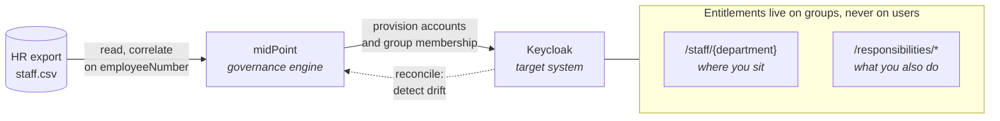

# Sigilla IGA Lab

Identity Governance and Administration lab built on open source components,
modelling a fictional international boarding school in Switzerland.

**Status:** work in progress. See [Where this stands](#where-this-stands) for what
is built and what is not.

## What this lab sets out to demonstrate

An end-to-end identity lifecycle driven from an authoritative HR source:



- **Joiner** — a new HR record provisions an account with the correct group memberships
- **Mover** — a department or responsibility change adjusts entitlements automatically
- **Leaver** — a termination date disables the account and revokes all access
- **Reconciliation** — accounts created outside the process are detected and corrected
- **Segregation of duties** — conflicting entitlements are detected and remediated

## Where this stands

**Built and verified**

- Keycloak target: realm, declarative user profile with HR-derived attributes,
  twelve entitlements, a two-branch group model, and group inheritance verified
  against three hand-made accounts
- Realm configuration exported to `keycloak/realm-sigilla.json`, schema included
- Authoritative HR source: sixteen records in `hr-source/staff.csv`, covering
  every department, a management chain, a leaver, and two deliberate
  segregation-of-duties conflicts
- midPoint and Keycloak running side by side from one compose file, on a shared
  network
- CSV resource created in midPoint, correlating and naming on `employeeNumber`,
  all sixteen accounts readable

**Not built yet**

- Attribute mappings from the CSV into midPoint user objects
- The Keycloak resource as a provisioning target
- The joiner, mover and leaver flows themselves
- The exclusion rule that detects the planted SoD conflicts
- midPoint objects exported to XML and version controlled

The reasoning behind each decision, including one that turned out to be wrong,
is recorded in [LAB-LOG.md](LAB-LOG.md).

## Why Keycloak and midPoint

Both are open source, but the concepts map directly onto commercial platforms.
Resources, connectors, correlation, mappings, role assignment and access
certification work the same way in SailPoint, Saviynt or Entra ID Governance.
The syntax changes; the model does not.

## The scenario

**Sigilla International School** (`sigilla.ch`) — a fictional international
boarding school. The name is deliberately fictional: no real institution
carries it, which matters when a public repository contains invented HR records.

Phase 1 covers staff. Students are a planned extension (see Roadmap).

### Departments

`academic` · `admissions` · `finance` · `it` · `hr` · `boarding` · `operations`

### Group model

Two independent branches, because organisational position and functional
responsibility are different dimensions:

```
/staff                                     -> portal-access
├── /staff/academic                        -> academic-records-read, academic-records-write
├── /staff/admissions                      -> admissions-data-read, admissions-data-write
├── /staff/finance                         -> finance-read, finance-write
├── /staff/it                              -> it-admin
├── /staff/hr                              -> hr-data-read, hr-data-write
├── /staff/boarding                        -> student-welfare-read
└── /staff/operations                      -> (inherits from /staff)

/responsibilities
├── /responsibilities/heads-of-department  -> academic-records-read
├── /responsibilities/residential-tutors   -> student-welfare-read
└── /responsibilities/finance-approvers    -> finance-approve
```

A teacher who also serves as a residential tutor belongs to
`/staff/academic` **and** `/responsibilities/residential-tutors`. Dropping the
tutoring role removes only the second membership. Modelling both dimensions in
a single branch would force a workaround for this ordinary case.

Subgroups inherit roles from their parent, so `portal-access` is declared once
on `/staff` and reaches everyone.

### Segregation of duties

`finance-write` (from `/staff/finance`) and `finance-approve` (from
`/responsibilities/finance-approvers`) are mutually exclusive. Whoever records
an invoice must not approve its payment.

The conflict is built into the model on purpose, so that detection and
remediation can be demonstrated rather than described.

### Authoritative HR source

```
employeeNumber,firstName,lastName,email,department,jobTitle,
managerEmployeeNumber,isResidentialTutor,isHeadOfDepartment,startDate,endDate
```

`employeeNumber` is the correlation identifier: immutable and semantically
empty. Correlating on email or username breaks the moment someone changes
their name, leaving an orphaned account and a duplicate — an audit finding.

An empty `endDate` means an active employee; a populated one triggers the
leaver flow.

## Running the lab

```bash
git clone <this-repo> && cd sigilla-iga-lab
docker compose up -d
docker compose logs -f keycloak
```

Keycloak admin console: http://localhost:8080

## Roadmap

- [ ] Students as a second authoritative source, with its own lifecycle rules
- [ ] Access certification campaign driven by line managers
- [ ] Second target system (LDAP or Google Workspace) to demonstrate connectors
- [ ] Realm configuration exported to JSON and version controlled
- [ ] Credentials moved to `.env`, with `.env.example` committed

## Notes

See [LAB-LOG.md](LAB-LOG.md) for build decisions and their rationale.
